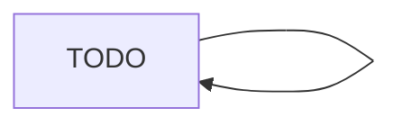

# TODO — package ou sujet

> TODO: une phrase — ce que couvre cette page.

## Rôle & responsabilités

TODO: ce dont ce package/sujet est responsable, et ce qu'il ne fait pas.

## Flux principaux

TODO: décrire le flux ; ajouter un diagramme quand il clarifie.

## Dépendances & cibles

TODO: dépendances externes, spécificités cible native (`!js`) / web (`js`).

## Invariants & pièges

TODO: invariants tenus, cas non triviaux. Lier les ADR concernés :
[ADR-TODO](decisions/TODO.md).

## Cas de test associés

TODO: tests (`*_test.go`) qui exercent ce package.
