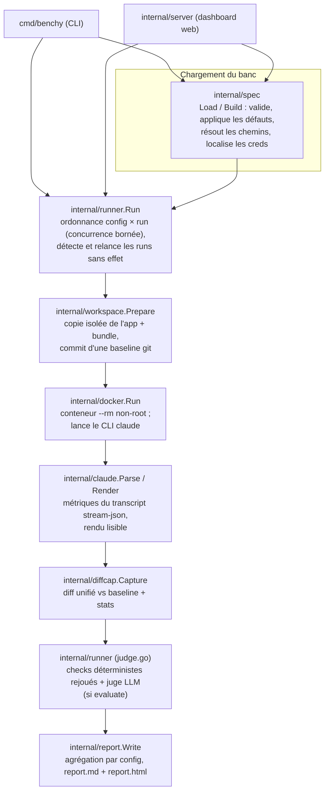

# Architecture — vue d'ensemble

> Comment benchy est bâti : un pipeline linéaire, orchestré par `internal/runner`,
> réutilisé à l'identique par la CLI et par le dashboard web.

## Le flux d'un banc

Le chemin d'un banc traverse les packages dans un ordre fixe. La CLI
(`cmd/benchy`) et le dashboard (`internal/server`) appellent tous deux
`runner.Run`, `runner.Reload` et `report.Write` — il n'existe qu'un seul pipeline.

## Rôle de chaque package

| Package | Rôle | Page |
|---|---|---|
| `cmd/benchy` | Point d'entrée CLI : sous-commandes `run`, `new`, `report`, `serve`, `build-image`. | [cmd/benchy](cmd/benchy.md) |
| `internal/spec` | Charge et valide le fichier de banc ; résout les chemins ; localise les creds OAuth. | [internal/spec](internal/spec.md) |
| `internal/workspace` | Copie isolée de l'app, superposition du bundle, baseline git. | [internal/workspace](internal/workspace.md) |
| `internal/docker` | Construit et lance le conteneur sandbox (`RunArgs` est une fonction pure). | [internal/docker](internal/docker.md) |
| `internal/claude` | Parse le transcript `stream-json` (métriques) et le rend en lignes lisibles. | [internal/claude](internal/claude.md) |
| `internal/diffcap` | Capture les changements du workspace en diff unifié vs baseline. | [internal/diffcap](internal/diffcap.md) |
| `internal/runner` | Cœur : ordonnancement, runs sans effet + relance, juge LLM, reload. | [internal/runner](internal/runner.md) |
| `internal/report` | Agrège les résultats en `report.md` + `report.html` (design Benchy). | [internal/report](internal/report.md) |
| `internal/server` | Dashboard web (bibliothèque standard) : formulaire, live SSE, historique. | [internal/server](internal/server.md) |

## Dépendances externes

Le projet n'a **qu'une dépendance externe** : `gopkg.in/yaml.v3` (`go.mod`). Tout
le reste s'appuie sur la bibliothèque standard. La chaîne d'outils Go tourne
**exclusivement dans Docker** (voir [ADR-0004](decisions/0004-toolchain-go-exclusivement-docker.md)).

## Invariant central à préserver

Un run peut « réussir » côté CLI sans rien produire (aucun appel d'outil ou diff
vide) : c'est un **faux succès**. La détection de ces **runs sans effet**, leur
relance, puis leur exclusion des agrégations est une invariante métier centrale,
portée par `internal/runner` et `internal/report` — voir
[ADR-0001](decisions/0001-runs-sans-effet-detection-relance-exclusion.md) et la
page [Runs sans effet](../fonctionnel/execution/runs-sans-effet.md).

## Décisions structurantes

Les choix non triviaux sont figés en [ADR](decisions/index.md).
